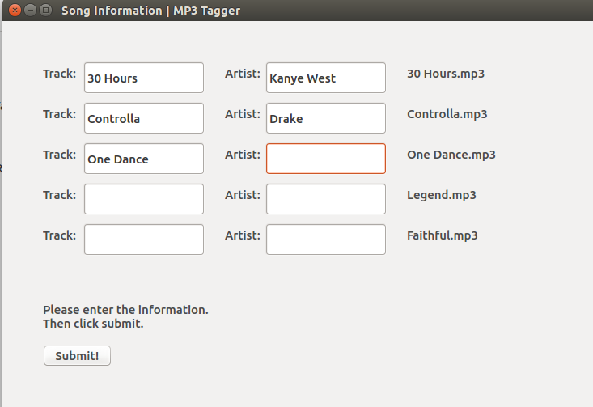
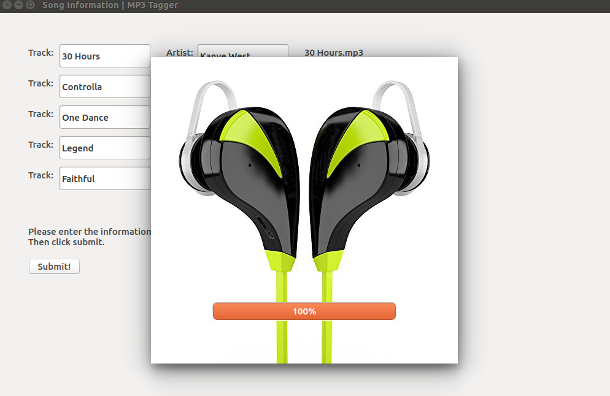
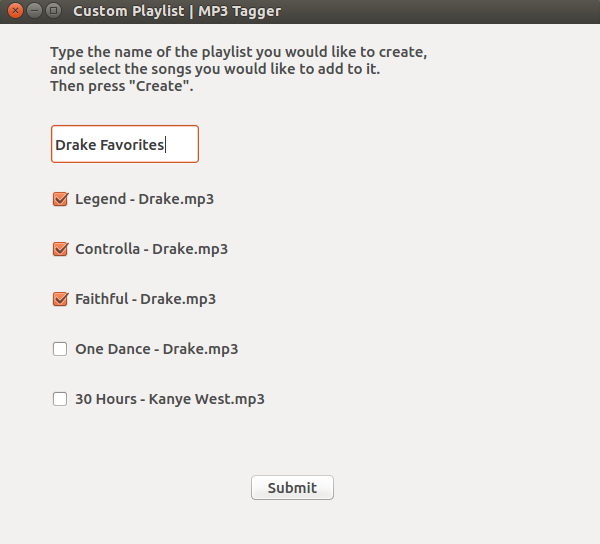

# MP3-Tagger
This utility tags MP3 files with their proper metadata and allows the user to create playlists. Specifically, MP3-Tagger reads in all the MP3 files in the directory of the file ``run.py``. To run, the user must have the PyQt and Mutagen modules installed on their computers.

The user must input two pieces of information for each song - Artist Name and Track Name. 
   
The utility uses this to query the GraceNote music database to retrieve all relevant metadata information for that song, including genre, artist name, album name, year, and album art. This is then written into the MP3 file's metadata in IDv3 format.   

The utility then allows the user to sort the music into playlists. Users can specify to automatically sort it by:
  - Genre
  - Album
  - Artist
  - Year  
Or, users can manually select which songs to put into folders of their own choice.  

Enjoy! :)
